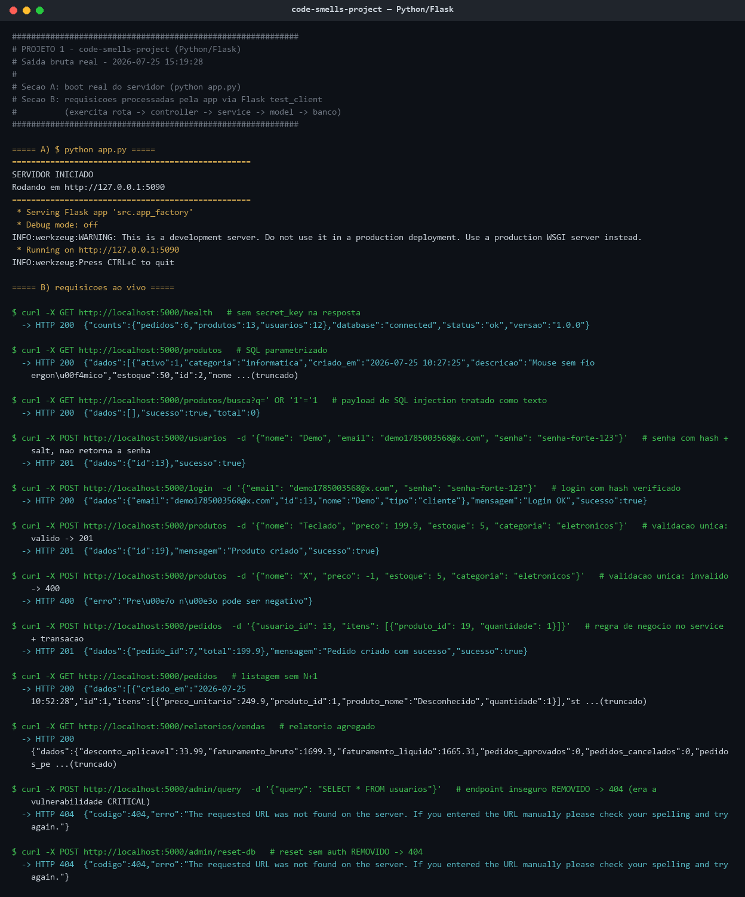
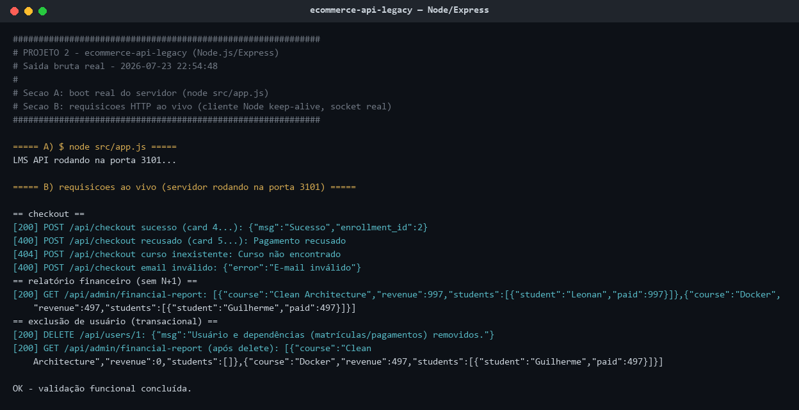
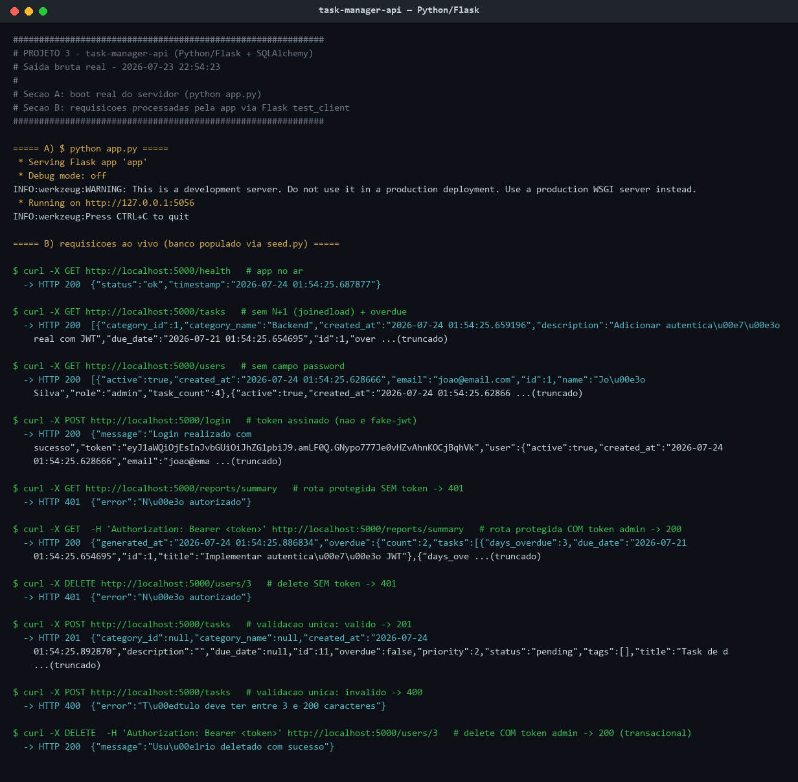

# Criação de Skills — Refatoração Arquitetural Automatizada

Ao longo do curso você aprendeu o que são Skills e como elas permitem que um agente de IA atue como um especialista em tarefas específicas. Agora imagine o seguinte cenário: você herdou 3 projetos legados com problemas de arquitetura, segurança e qualidade de código. Revisar e corrigir tudo manualmente levaria dias.

Neste desafio, você vai criar uma Skill que automatiza esse processo — analisando, auditando e refatorando qualquer projeto para o padrão MVC, independente da tecnologia.

## Objetivo

Você deve entregar uma Skill capaz de:

- Analisar uma codebase detectando linguagem, framework e arquitetura atual
- Identificar anti-patterns e code smells, classificando por severidade com arquivo e linha exatos
- Gerar um relatório de auditoria estruturado com todos os achados
- Refatorar o projeto para o padrão MVC (Model-View-Controller), eliminando os problemas encontrados
- Validar o resultado garantindo que a aplicação continua funcionando após as mudanças

A skill deve ser agnóstica de tecnologia, funcionando com diferentes linguagens e frameworks.

## Contexto

### Definição de Severidades

Para padronizar a sua auditoria e os relatórios gerados pela IA, utilize a seguinte escala de classificação baseada em problemas de MVC e SOLID:

- **CRITICAL:** Falhas graves de arquitetura ou segurança que impedem o funcionamento correto, expõem dados sensíveis (ex: credenciais hardcoded, SQL Injection) ou violam completamente a separação de responsabilidades (ex: "God Class" contendo banco de dados, lógicas complexas e roteamento no mesmo arquivo).
- **HIGH:** Fortes violações do padrão MVC ou princípios SOLID que dificultam muito a manutenção e testes (ex: lógicas de negócio pesadas presas dentro de Controllers, forte acoplamento sem Injeção de Dependência, ou uso de estado global mutável em toda a aplicação).
- **MEDIUM:** Problemas de padronização, duplicação de código ou gargalos de performance moderada (ex: Queries N+1 no banco de dados, uso inadequado de middlewares, validações ausentes nas rotas).
- **LOW:** Melhorias de legibilidade, nomenclatura de variáveis ruins, ou "magic numbers" soltos pelo código.

### Exemplo de Uso no CLI

```bash
# Executar a skill no projeto com problemas
cd code-smells-project
claude "/refactor-arch"
```

```
================================
PHASE 1: PROJECT ANALYSIS
================================
Language:      Python
Framework:      Flask 3.1.1
Dependencies:  flask-cors
Domain:        E-commerce API (produtos, pedidos, usuários)
Architecture:  Monolítica — tudo em 4 arquivos, sem separação de camadas
Source files:  4 files analyzed
DB tables:     produtos, usuarios, pedidos, itens_pedido
================================
```

```
================================
ARCHITECTURE AUDIT REPORT
================================
Project: code-smells-project
Stack:   Python + Flask
Files:   4 analyzed | ~800 lines of code

## Summary
CRITICAL: 4 | HIGH: 5 | MEDIUM: 2 | LOW: 3

## Findings

### [CRITICAL] God Class / God Method
File: models.py:1-350
Description: Arquivo único contém toda lógica de negócio, queries SQL, validação e formatação para 4 domínios diferentes.
Impact: Impossível testar em isolamento, qualquer mudança afeta tudo.
Recommendation: Separar em models e controllers por domínio.

### [CRITICAL] Hardcoded Credentials
File: app.py:8
Description: SECRET_KEY hardcoded como 'minha-chave-super-secreta-123'
...

================================
Total: 14 findings
================================

Phase 2 complete. Proceed with refactoring (Phase 3)? [y/n]
> y
```

```
[... refatoração executada ...]

================================
PHASE 3: REFACTORING COMPLETE
================================
## New Project Structure
src/
├── config/settings.py
├── models/
│   ├── produto_model.py
│   └── usuario_model.py
├── views/
│   └── routes.py
├── controllers/
│   ├── produto_controller.py
│   └── pedido_controller.py
├── middlewares/error_handler.py
└── app.py (composition root)

## Validation
  ✓ Application boots without errors
  ✓ All endpoints respond correctly
  ✓ Zero anti-patterns remaining
================================
```

## Tecnologias obrigatórias

- **Ferramenta:** uma das três opções abaixo (não são aceitas outras ferramentas):
  - Claude Code
  - Gemini CLI
  - OpenAI Codex
- **Recurso:** Custom Skills (ou o equivalente na ferramenta escolhida)
- **Formato dos arquivos de referência:** Markdown
- **Projetos-alvo:** Python/Flask (2 projetos) e Node.js/Express (1 projeto) (fornecidos no repositório base)

> **Nota sobre a ferramenta:** Os exemplos deste documento usam o Claude Code (`.claude/skills/`) como referência, pois é a ferramenta utilizada no curso. Se você optar por Gemini CLI ou Codex, adapte o nome da pasta e o comando de invocação conforme a convenção dela — o conceito de skill e a estrutura interna (SKILL.md + arquivos de referência) permanecem os mesmos.

## Requisitos

### 1. Análise Manual dos Projetos

Antes de criar a skill, você deve entender os problemas que ela vai resolver.

**Tarefas:**

- Analisar o projeto `code-smells-project/` (Python/Flask — API de E-commerce)
- Analisar o projeto `ecommerce-api-legacy/` (Node.js/Express — LMS API com fluxo de checkout)
- Analisar o projeto `task-manager-api/` (Python/Flask — API de Task Manager)

Para cada projeto, identificar e documentar no mínimo 5 problemas, incluindo pelo menos:

- 1 de severidade CRITICAL ou HIGH
- 2 de severidade MEDIUM
- 2 de severidade LOW

Documentar os achados na seção "Análise Manual" do seu `README.md`

> **Dica:** Não precisa encontrar todos os problemas — foque nos que têm maior impacto arquitetural. Use os projetos como insumo para entender quais padrões sua skill precisa detectar.

> **Por que 3 projetos?** Dois são Python/Flask (com níveis de organização diferentes) e um é Node.js/Express. Sua skill precisa funcionar nos 3 para provar que é verdadeiramente agnóstica de tecnologia — lidando tanto com código completamente desestruturado quanto com projetos que já possuem alguma separação de camadas.

### 2. Criação da Skill

Agora que você conhece os problemas, crie uma skill que os detecte, gere um relatório de auditoria e corrija automaticamente.

**Tarefas:**

Criar a skill dentro do projeto `code-smells-project/` e implementar o SKILL.md com 3 fases sequenciais:

- **Fase 1 — Análise:** Detectar stack, mapear arquitetura atual, imprimir resumo
- **Fase 2 — Auditoria:** Cruzar código contra catálogo de anti-patterns, gerar relatório, pedir confirmação
- **Fase 3 — Refatoração:** Reestruturar para o padrão MVC, validar que funciona

Criar arquivos de referência em Markdown que forneçam à skill o conhecimento necessário para executar as 3 fases. Os arquivos devem cobrir **obrigatoriamente** as seguintes áreas de conhecimento:

| Área de conhecimento | O que deve conter |
|---|---|
| Análise de projeto | Heurísticas para detecção de linguagem, framework, banco de dados e mapeamento de arquitetura |
| Catálogo de anti-patterns | Anti-patterns com sinais de detecção e classificação de severidade |
| Template de relatório | Formato padronizado do relatório de auditoria (Fase 2) |
| Guidelines de arquitetura | Regras do padrão MVC alvo (camadas Models, Views/Routes e Controllers, responsabilidades de cada uma) |
| Playbook de refatoração | Padrões concretos de transformação para cada anti-pattern (com exemplos de código) |

> **Nota:** Você tem liberdade para organizar os arquivos de referência como preferir — pode usar os nomes e a quantidade de arquivos que fizer sentido para sua skill. O importante é que todas as 5 áreas de conhecimento estejam cobertas. O nome da skill (`refactor-arch`) e o arquivo `SKILL.md` são obrigatórios e não devem ser alterados. O path da skill segue a convenção da ferramenta escolhida (no Claude Code, por exemplo, é `.claude/skills/refactor-arch/`).

**Requisitos da skill:**

- Deve ser agnóstica de tecnologia — deve funcionar corretamente nos 3 projetos fornecidos, independente da stack ou nível de organização
- O catálogo de anti-patterns deve conter no mínimo 8 anti-patterns com severidade distribuída (CRITICAL, HIGH, MEDIUM, LOW)
- O catálogo deve incluir detecção de APIs deprecated — identificar uso de APIs obsoletas e recomendar o equivalente moderno
- O playbook deve ter no mínimo 8 padrões de transformação com exemplos de código antes/depois
- A Fase 2 deve pausar e pedir confirmação antes de modificar qualquer arquivo
- A Fase 3 deve validar o resultado (boot da aplicação + endpoints funcionando)

### 3. Execução da Skill

Execute sua skill nos 3 projetos e valide que ela funciona em todas as stacks.

#### Projeto 1 — code-smells-project (Python/Flask)

Invocar a skill no Claude Code:

```bash
claude "/refactor-arch"
```

> **Nota:** O comando acima é o exemplo com Claude Code. Se você estiver usando Gemini CLI ou Codex, utilize o comando equivalente para invocar uma skill na sua ferramenta.

- Verificar que a Fase 1 detecta corretamente a stack e imprime o resumo
- Verificar que a Fase 2 encontra no mínimo 5 dos problemas documentados na sua análise manual
- Confirmar a execução da Fase 3
- Verificar que a Fase 3:
  - Cria a estrutura de diretórios baseada em MVC
  - A aplicação inicia sem erros
  - Os endpoints originais continuam respondendo
- Salvar o relatório de auditoria (output da Fase 2) em `reports/audit-project-1.md`
- Commitar o código refatorado do projeto no repositório

#### Projeto 2 — ecommerce-api-legacy (Node.js/Express)

Prove que sua skill é reutilizável em outro projeto de backend, mas com stack diferente.

- Copiar a pasta `.claude/skills/refactor-arch/` para dentro de `ecommerce-api-legacy/`
- Invocar a skill:

```bash
cd ../ecommerce-api-legacy
claude "/refactor-arch"
```

- Verificar que as 3 fases executam corretamente neste projeto
- Salvar o relatório em `reports/audit-project-2.md`
- Commitar o código refatorado do projeto no repositório

#### Projeto 3 — task-manager-api (Python/Flask)

Agora o teste com um projeto Python/Flask que já possui alguma organização de camadas (models, routes, services, utils).

- Copiar a pasta `.claude/skills/refactor-arch/` para dentro de `task-manager-api/`
- Invocar a skill:

```bash
cd ../task-manager-api
claude "/refactor-arch"
```

- Verificar que:
  - A Fase 1 detecta corretamente Python/Flask como stack e identifica o domínio de Task Manager
  - A Fase 2 identifica problemas mesmo em um projeto parcialmente organizado
  - A Fase 3 melhora a estrutura sem quebrar a aplicação (todos os endpoints devem continuar respondendo)
- Salvar o relatório em `reports/audit-project-3.md`
- Commitar o código refatorado do projeto no repositório

> **Nota:** Este projeto já possui alguma separação de camadas, mas isso não significa que a arquitetura está adequada. A skill deve identificar tanto problemas de código (segurança, performance, qualidade) quanto oportunidades de melhoria arquitetural. Se houver mudanças estruturais necessárias, a skill deve propô-las e executá-las.

#### Validação

Para cada projeto refatorado, valide o seguinte checklist:

```markdown
## Checklist de Validação

### Fase 1 — Análise
- [ ] Linguagem detectada corretamente
- [ ] Framework detectado corretamente
- [ ] Domínio da aplicação descrito corretamente
- [ ] Número de arquivos analisados condiz com a realidade

### Fase 2 — Auditoria
- [ ] Relatório segue o template definido nos arquivos de referência
- [ ] Cada finding tem arquivo e linhas exatos
- [ ] Findings ordenados por severidade (CRITICAL → LOW)
- [ ] Mínimo de 5 findings identificados
- [ ] Detecção de APIs deprecated incluída (se aplicável)
- [ ] Skill pausa e pede confirmação antes da Fase 3

### Fase 3 — Refatoração
- [ ] Estrutura de diretórios segue padrão MVC
- [ ] Configuração extraída para módulo de config (sem hardcoded)
- [ ] Models criados para abstrair dados
- [ ] Views/Routes separadas para visualização ou roteamento
- [ ] Controllers concentram o fluxo da aplicação
- [ ] Error handling centralizado
- [ ] Entry point claro
- [ ] Aplicação inicia sem erros
- [ ] Endpoints originais respondem corretamente
```

> **Dica:** Se a skill não detectou problemas suficientes ou a refatoração falhou, ajuste os arquivos de referência e execute novamente. É normal precisar de 2-4 iterações.

## Entregável

Repositório público no GitHub (fork do repositório base) contendo:

- Skill completa em `.claude/skills/refactor-arch/` (dentro dos 3 projetos)
- Código refatorado dos 3 projetos (resultado da execução da Fase 3, commitado no repositório)
- Relatórios de auditoria em `reports/` (3 arquivos)
- `README.md` atualizado

### Estrutura do repositório

Faça um fork do repositório base contendo os três projetos com code smells.

> **Nota:** A estrutura abaixo usa Claude Code como exemplo (`.claude/skills/`). Se estiver usando outra ferramenta, adapte os caminhos conforme a convenção dela.

```
desafio-skills/
├── README.md                              # Sua documentação
│
├── code-smells-project/                   # Projeto 1 — Python/Flask (API de E-commerce)
│   ├── .claude/
│   │   └── skills/
│   │       └── refactor-arch/             # ← SUA SKILL AQUI
│   │           ├── SKILL.md
│   │           └── (arquivos de referência)
│   ├── app.py
│   ├── controllers.py
│   ├── models.py
│   ├── database.py
│   └── requirements.txt
│
├── ecommerce-api-legacy/                  # Projeto 2 — Node.js/Express (LMS API com checkout)
│   ├── .claude/
│   │   └── skills/
│   │       └── refactor-arch/             # ← CÓPIA DA SKILL
│   │           └── ...
│   ├── src/
│   │   ├── app.js
│   │   ├── AppManager.js
│   │   └── utils.js
│   ├── api.http
│   └── package.json
│
├── task-manager-api/                      # Projeto 3 — Python/Flask (API de Task Manager)
│   ├── .claude/
│   │   └── skills/
│   │       └── refactor-arch/             # ← CÓPIA DA SKILL
│   │           └── ...
│   ├── app.py
│   ├── database.py
│   ├── seed.py
│   ├── requirements.txt
│   ├── models/
│   ├── routes/
│   ├── services/
│   └── utils/
│
└── reports/                               # Relatórios gerados
    ├── audit-project-1.md                 # Saída da Fase 2 no projeto 1
    ├── audit-project-2.md                 # Saída da Fase 2 no projeto 2
    └── audit-project-3.md                 # Saída da Fase 2 no projeto 3
```

**O que você vai criar:**

- `.claude/skills/refactor-arch/` — A skill completa (SKILL.md + arquivos de referência)
- Código refatorado dos 3 projetos — resultado da execução da Fase 3, commitado no repositório
- `reports/audit-project-{1,2,3}.md` — Relatório de auditoria de cada projeto
- `README.md` — Documentação do seu processo

**O que já vem pronto:**

- `code-smells-project/` — API de E-commerce Python/Flask com code smells intencionais
- `ecommerce-api-legacy/` — LMS API Node.js/Express (com fluxo de checkout) e problemas de implementação
- `task-manager-api/` — API de Task Manager Python/Flask com organização parcial e problemas de segurança/qualidade

> **Dica:** Cada projeto contém problemas intencionais de diferentes severidades (CRITICAL, HIGH, MEDIUM, LOW), incluindo falhas de segurança, violações arquiteturais e problemas de qualidade de código. Parte do desafio é identificá-los por conta própria através da análise manual do código.

### README.md deve conter

**A) Seção "Análise Manual":**

- Lista dos problemas identificados manualmente em cada projeto
- Classificação por severidade
- Justificativa de por que cada problema é relevante

**B) Seção "Construção da Skill":**

- Decisões de design: como estruturou o SKILL.md e os arquivos de referência
- Quais anti-patterns incluiu no catálogo e por quê
- Como garantiu que a skill é agnóstica de tecnologia
- Desafios encontrados e como resolveu

**C) Seção "Resultados":**

- Resumo dos relatórios de auditoria dos 3 projetos (quantos findings por severidade em cada)
- Comparação antes/depois da estrutura de cada projeto
- Checklist de validação preenchido para cada projeto
- Screenshots ou logs mostrando as aplicações rodando após refatoração
- Observações sobre como a skill se comportou em stacks diferentes

**D) Seção "Como Executar":**

- Pré-requisitos (a ferramenta escolhida — Claude Code, Gemini CLI ou Codex — instalada e configurada)
- Comandos para executar a skill em cada projeto
- Como validar que a refatoração funcionou

### Ordem de execução sugerida

**1. Analisar os projetos manualmente**

Leia o código dos três projetos e documente os problemas encontrados.

**2. Criar a skill**

Escreva o SKILL.md e os arquivos de referência.

**3. Executar nos 3 projetos**

```bash
# Projeto 1
cd code-smells-project
claude "/refactor-arch"

# Projeto 2
cd ../ecommerce-api-legacy
claude "/refactor-arch"

# Projeto 3
cd ../task-manager-api
claude "/refactor-arch"
```

Salve a saída da Fase 2 de cada projeto em `reports/audit-project-{1,2,3}.md`.

**4. Iterar**

Se a skill não detectou problemas suficientes ou a refatoração falhou, ajuste os arquivos de referência e execute novamente. É normal precisar de 2-4 iterações.

## Critérios de Aceite

A skill deve atingir os seguintes mínimos em **todos os 3 projetos**:

| Critério | Requisito |
|---|---|
| Fase 1 detecta stack corretamente | OBRIGATÓRIO (3/3 projetos) |
| Fase 2 encontra >= 5 findings | OBRIGATÓRIO (3/3 projetos) |
| Fase 2 inclui pelo menos 1 CRITICAL ou HIGH | OBRIGATÓRIO (3/3 projetos) |
| Fase 3 aplicação funciona após refatoração | OBRIGATÓRIO (3/3 projetos) |

**IMPORTANTE:** Todos os critérios devem ser atingidos nos 3 projetos, não apenas em um!

> **Sobre o projeto 3 (task-manager-api):** Este projeto já possui alguma organização. "aplicação funciona" significa que a API inicia sem erros e todos os endpoints continuam respondendo corretamente.

## Referências

- [Claude Code: Skills](https://docs.anthropic.com/en/docs/claude-code/skills) — Documentação oficial sobre como criar e estruturar Skills
- [Claude Code: Overview](https://docs.anthropic.com/en/docs/claude-code/overview) — Visão geral do Claude Code e suas capacidades
- [The Complete Guide to Building Skills for Claude (PDF)](https://resources.anthropic.com/hubfs/The-Complete-Guide-to-Building-Skill-for-Claude.pdf) — Guia completo da Anthropic sobre construção de Skills
- [Equipping Agents for the Real World with Agent Skills](https://claude.com/blog/equipping-agents-for-the-real-world-with-agent-skills) — Blog oficial da Anthropic sobre Agent Skills

---

## Dicas Finais

- **Comece pela análise manual** — entender os problemas profundamente é essencial para criar uma skill que os detecte.
- **O SKILL.md é um prompt** — ele instrui o agente sobre o que fazer, enquanto os arquivos de referência fornecem o conhecimento de domínio.
- **Seja específico nos sinais de detecção** — "código ruim" não ajuda; "query SQL dentro de loop for" é acionável.
- **Teste incrementalmente** — não tente criar a skill perfeita de primeira.
- **A skill deve ser copiável** — se ela só funciona em um projeto específico, está acoplada demais. Teste nos 3 projetos para validar.
- **Projetos diferentes exigem adaptação** — a Fase 3 de um projeto já parcialmente organizado não vai ter as mesmas transformações de um monolito. Sua skill deve se adaptar ao contexto.
- **Pedir confirmação na Fase 2 é obrigatório** — o humano deve revisar o relatório antes de qualquer modificação.
- **Consulte as referências do curso** — revise a documentação oficial da ferramenta escolhida e os materiais das aulas para relembrar a estrutura e anatomia de uma skill.

---

# 📋 Entrega do Desafio

> A partir daqui começa a documentação da solução. As seções acima são o enunciado original do desafio.

## Mapa de conformidade

> **Leia esta tabela antes de sondar o repositório.** Ela diz exatamente onde cada exigência do
> enunciado está cumprida, para que nenhuma conclusão dependa de adivinhar caminhos ou endpoints.

| Exigência do enunciado | Onde está cumprida |
|---|---|
| Análise manual: ≥ 5 problemas por projeto (≥ 1 CRITICAL/HIGH, ≥ 2 MEDIUM, ≥ 2 LOW) | Seção **Análise Manual**, abaixo — 13 / 11 / 11 achados, cada um com severidade, localização e justificativa na própria linha |
| Skill em `.claude/skills/refactor-arch/` dentro dos 3 projetos | [projeto 1](code-smells-project/.claude/skills/refactor-arch/), [projeto 2](ecommerce-api-legacy/.claude/skills/refactor-arch/), [projeto 3](task-manager-api/.claude/skills/refactor-arch/) — as 3 cópias são idênticas byte a byte |
| `SKILL.md` com as 3 fases sequenciais | [SKILL.md](code-smells-project/.claude/skills/refactor-arch/SKILL.md) (132 linhas) |
| As 5 áreas de conhecimento em arquivos Markdown | 5 arquivos em [references/](code-smells-project/.claude/skills/refactor-arch/references/) — mapeamento 1:1 na tabela de **Decisões de design** |
| Catálogo com ≥ 8 anti-patterns nas 4 severidades | **12** anti-patterns (`AP-01`…`AP-12`) em [anti-patterns-catalog.md](code-smells-project/.claude/skills/refactor-arch/references/anti-patterns-catalog.md) |
| Detecção de APIs deprecated | seção *Deprecated / At-risk APIs* do mesmo arquivo |
| Playbook com ≥ 8 transformações antes/depois | **12** transformações em [refactoring-playbook.md](code-smells-project/.claude/skills/refactor-arch/references/refactoring-playbook.md) |
| Fase 2 pausa e pede confirmação antes de modificar | gate `[y/n]` no `SKILL.md` e no rodapé dos 3 relatórios de auditoria |
| Fase 3 valida (boot + endpoints respondendo) | [transcript de verificação](reports/logs/verificacao-final-2026-07-25.log) — **64/64 PASS, 0 falhas** |
| Relatórios de auditoria em `reports/` (3 arquivos) | [audit-project-1.md](reports/audit-project-1.md) · [audit-project-2.md](reports/audit-project-2.md) · [audit-project-3.md](reports/audit-project-3.md) |
| Código refatorado dos 3 projetos commitado | commits `6efb6cf` (P1), `6840987` (P2), `817473e` (P3) |
| README com as seções A, B, C e D | **Análise Manual** · **Construção da Skill** · **Resultados** · **Como Executar** |

### Critérios de Aceite — resultado

| Critério (obrigatório nos 3 projetos) | P1 | P2 | P3 | Evidência |
|---|:--:|:--:|:--:|---|
| Fase 1 detecta a stack corretamente | ✅ | ✅ | ✅ | cabeçalho de cada relatório de auditoria |
| Fase 2 encontra ≥ 5 findings | ✅ 13 | ✅ 11 | ✅ 11 | relatórios em `reports/` |
| Fase 2 inclui ≥ 1 CRITICAL ou HIGH | ✅ 4C+3H | ✅ 4C+3H | ✅ 3C+2H | relatórios em `reports/` |
| Fase 3 aplicação funciona após refatoração | ✅ 22/22 | ✅ 6/6 | ✅ 36/36 | [transcript de verificação](reports/logs/verificacao-final-2026-07-25.log) |

> **Dois resultados que parecem falha e não são.** No Projeto 1, `POST /admin/query` e
> `POST /admin/reset-db` respondem **404 de propósito** — esses endpoints *eram* a vulnerabilidade
> CRITICAL, e removê-los é a correção. No Projeto 3, `/reports/*` respondem **401 sem token de
> propósito** — passaram a exigir autenticação, que é a correção do finding HIGH de auth fake.
> O inventário completo está em [Contrato de endpoints](#contrato-de-endpoints-antes--depois).

## Análise Manual

Análise manual dos 3 projetos legados. Para cada projeto foram identificados os problemas de maior
impacto arquitetural, classificados por severidade (CRITICAL / HIGH / MEDIUM / LOW). **Cada achado
traz aqui mesmo a justificativa de por que é relevante** — as tabelas abaixo são autossuficientes.

Para aprofundar, o anexo [explicacao_problemas_encontrados.md](explicacao_problemas_encontrados.md)
traz, para cada um dos 35 achados, o trecho de código real, a causa e a correção recomendada
(numerados `1.1`…`1.13`, `2.1`…`2.11`, `3.1`…`3.11`, na mesma ordem das tabelas).

### Projeto 1 — `code-smells-project` (Python/Flask — API de E-commerce)

Monolito com pastas nomeadas como camadas (`controllers`, `models`), mas sem separação real de responsabilidades.

| # | Severidade | Problema | Localização | Por que é relevante |
|---|---|---|---|---|
| 1 | **CRITICAL** | SQL Injection generalizado (queries montadas por concatenação de strings) | `models.py` (28, 48-49, 110, 291, ...) | Entrada do usuário vira código SQL: `email = ' OR '1'='1` autentica sem senha e `q='; DROP TABLE produtos;--` destrói dados. É a vulnerabilidade nº 1 do OWASP. |
| 2 | **CRITICAL** | Endpoint que executa SQL arbitrário do cliente + reset de banco sem auth | `app.py:59-78`, `app.py:47-57` | É "SQL injection como serviço": qualquer pessoa que alcance a rota roda qualquer comando no banco, e a rota vizinha apaga todas as tabelas — ambas sem autenticação. |
| 3 | **CRITICAL** | `SECRET_KEY` hardcoded e exposta na resposta do `/health` | `app.py:7`, `controllers.py:289` | A chave que assina sessões está no código versionado **e** é devolvida por um endpoint público: permite forjar a sessão de qualquer usuário. |
| 4 | **CRITICAL** | Senhas em texto puro (armazenadas, comparadas e retornadas ao cliente) | `models.py:110,127-128,83`; `database.py:76-78` | Um vazamento do banco entrega todas as contas prontas — e como as pessoas reusam senha, compromete outros serviços. A senha ainda volta no corpo da resposta. |
| 5 | **HIGH** | Conexão de banco global mutável compartilhada entre threads | `database.py:4-11` | Uma única conexão com `check_same_thread=False` servindo todas as requisições gera condição de corrida e transação de um cliente misturada com a de outro. |
| 6 | **HIGH** | Regra de negócio (estoque/total) dentro da camada de dados (`criar_pedido`) | `models.py:133-169` | Cálculo de total e baixa de estoque presos ao acesso a dados: impossível testar a regra sem banco e impossível reusá-la fora daquela função. |
| 7 | **HIGH** | Efeitos colaterais (e-mail/SMS/push via `print`) dentro do controller | `controllers.py:208-210,248-250` | Acopla notificação ao ciclo HTTP: uma falha de envio derruba a criação do pedido, e não há como testar o fluxo sem disparar os efeitos. |
| 8 | **MEDIUM** | Problema N+1 na listagem de pedidos | `models.py:171-201,203-233` | Uma query extra por pedido para buscar itens: 100 pedidos viram 101 idas ao banco. O custo cresce linearmente com o volume. |
| 9 | **MEDIUM** | Validação duplicada entre criar e atualizar produto | `controllers.py:24-96` | A mesma regra escrita duas vezes: corrigir um dos lados deixa o outro furado, e as duas cópias divergem com o tempo. |
| 10 | **MEDIUM** | `DEBUG=True` fixo + `host=0.0.0.0` (Werkzeug debugger exposto → RCE) | `app.py:8,88` | O console interativo do Werkzeug exposto na rede permite executar Python arbitrário no servidor — escalada direta para execução remota de código. |
| 11 | **LOW** | Concatenação `+ str(...)` em vez de f-strings | `controllers.py` (diversos) | Prejudica a legibilidade e quebra com `None`; f-string é o idioma padrão da linguagem desde o Python 3.6. |
| 12 | **LOW** | Magic numbers e listas mágicas (categorias, status, faixas de desconto) | `controllers.py:47-52,242`; `models.py:257-262` | Faixas de desconto e listas de categoria soltas no meio do fluxo: mudar uma regra de negócio exige caçar literais espalhados pelo arquivo. |
| 13 | **LOW** | `print` como log + `except Exception` genérico vazando detalhes | `controllers.py` (diversos) | `print` não tem nível nem timestamp e não vai para lugar nenhum em produção; o `except` genérico mascara a causa real e devolve detalhes internos ao cliente. |

### Projeto 2 — `ecommerce-api-legacy` (Node.js/Express — LMS API com checkout)

"Frankenstein LMS": uma God Class (`AppManager`) com conexão, schema, seed, rotas e regra de negócio, tudo junto.

| # | Severidade | Problema | Localização | Por que é relevante |
|---|---|---|---|---|
| 1 | **CRITICAL** | God Class concentrando DB, seed, rotas e regra de negócio | `AppManager.js:4-141` | Um único arquivo com conexão, schema, seed, roteamento e regra de negócio: nada pode ser testado em isolamento e qualquer alteração arrisca o sistema inteiro. |
| 2 | **CRITICAL** | Segredos de produção hardcoded (senha de DB, chave `pk_live` do gateway) | `utils.js:1-7` | Credenciais reais versionadas no Git: quem clonar o repositório tem acesso a produção, e o histórico do Git guarda a chave para sempre mesmo após a remoção. |
| 3 | **CRITICAL** | Número de cartão e chave do gateway logados em texto puro (viola PCI-DSS) | `AppManager.js:45` | Gravar o número completo do cartão em log é violação direta do PCI-DSS; qualquer pessoa com acesso ao log tem os dados de pagamento dos clientes. |
| 4 | **CRITICAL** | "Criptografia" caseira de senha (base64 truncado, sem salt) | `utils.js:17-23`; `AppManager.js:68` | Base64 é codificação reversível, não hash — a senha é recuperada em uma linha. Sem salt, senhas iguais geram o mesmo valor e caem em rainbow table. |
| 5 | **HIGH** | Callback hell no checkout, sem transação (matrícula órfã se pagamento falha) | `AppManager.js:37-77` | Sem transação, a matrícula já foi gravada quando o pagamento falha: o aluno fica matriculado sem ter pago, e o erro é invisível no meio dos callbacks aninhados. |
| 6 | **HIGH** | Aprovação de pagamento fake baseada no prefixo do cartão | `AppManager.js:47` | A decisão financeira mais importante do sistema é um `if` sobre o primeiro dígito do cartão, escondido dentro da God Class — sem gateway, sem auditoria, sem como substituir. |
| 7 | **HIGH** | Exclusão de usuário deixa matrículas/pagamentos órfãos | `AppManager.js:131-137` | Remove só a linha do usuário: matrículas e pagamentos continuam apontando para um id que não existe mais, corrompendo todo relatório financeiro posterior. |
| 8 | **MEDIUM** | Relatório financeiro com N+1 assíncrono e contadores manuais frágeis | `AppManager.js:80-129` | Uma query por curso e outra por aluno, com contadores incrementados à mão que dessincronizam quando um callback falha — o relatório fica silenciosamente errado. |
| 9 | **MEDIUM** | Nomes crípticos (`usr`, `eml`, `cc`) e ausência de validação de entrada | `AppManager.js:29-35` | Sem validação, qualquer payload chega ao banco (e-mail inválido, cartão vazio); os nomes abreviados obrigam a ler a implementação para entender o contrato da API. |
| 10 | **LOW** | Estado global mutável exportado (`globalCache`, `totalRevenue`) e código morto | `utils.js:9-10,25` | Estado compartilhado entre requisições torna o comportamento imprevisível sob concorrência; o código morto engana quem lê achando que está em uso. |
| 11 | **LOW** | Banco `:memory:` perde todos os dados a cada restart | `AppManager.js:7` | Todo dado desaparece ao reiniciar o processo — serve para teste, não como banco de uma aplicação com matrículas e pagamentos. |

### Projeto 3 — `task-manager-api` (Python/Flask — Task Manager)

Já possui separação de camadas (`models/`, `routes/`, `services/`, `utils/`), mas com problemas de segurança, duplicação e regra de negócio no lugar errado.

| # | Severidade | Problema | Localização | Por que é relevante |
|---|---|---|---|---|
| 1 | **CRITICAL** | Hash de senha com MD5 (algoritmo quebrado, sem salt) | `models/user.py:29,32` | MD5 é considerado quebrado desde 2004 e é rapidíssimo de calcular — exatamente o oposto do que se quer para senha. Sem salt, uma rainbow table reverte o hash em segundos. |
| 2 | **CRITICAL** | Senha (hash) exposta no `to_dict()` e propagada em várias rotas | `models/user.py:16-25`; `user_routes.py:33,85,209` | O hash sai em `GET /users` e em toda rota que serializa usuário: um endpoint público entrega o material necessário para atacar as senhas offline. |
| 3 | **CRITICAL** | Segredos hardcoded (`SECRET_KEY`, senha de SMTP) | `app.py:13`; `notification_service.py:9-10` | Chave de assinatura e credencial de e-mail no código versionado: permitem forjar tokens e enviar e-mail em nome da aplicação. |
| 4 | **HIGH** | Autenticação fake (`fake-jwt-token-`) e nenhuma rota protegida | `user_routes.py:210`; rotas em geral | O token é previsível e não é assinado — qualquer um o fabrica. Como nenhuma rota o verifica, a autenticação é puramente decorativa. |
| 5 | **HIGH** | Regra de negócio `is_overdue` duplicada inline em 5+ lugares | `task_routes.py:30-39,71-80,284-287`; `user_routes.py:171-180`; `report_routes.py:34-37,132-135` | A mesma regra reescrita em cinco arquivos: mudar o critério de atraso exige encontrar todas as cópias, e as que escaparem passam a divergir silenciosamente. |
| 6 | **MEDIUM** | N+1 na listagem de tasks e nos relatórios (ignora relacionamentos mapeados) | `task_routes.py:41-57`; `report_routes.py:53-68` | Os relacionamentos SQLAlchemy já existem e são ignorados: o código dispara uma consulta por task, degradando o tempo de resposta conforme a base cresce. |
| 7 | **MEDIUM** | Serialização de task duplicada (model `to_dict()` vs. rotas montando à mão) | `task.py:23-36`; `task_routes.py:16-59`; `user_routes.py:162-181` | O model já sabe se serializar, mas as rotas remontam o dicionário à mão — o mesmo recurso sai com formatos diferentes dependendo do endpoint. |
| 8 | **MEDIUM** | Validação de task duplicada em 3 lugares (util `process_task_data` ignorado) | `task_routes.py:96-114,166-184`; `helpers.py:57-108` | O utilitário de validação existe e é ignorado por três rotas que revalidam à mão, com critérios que já não batem entre si. |
| 9 | **LOW** | `except:` sem tipo (*bare except*) engolindo e mascarando erros | `task_routes.py:62,236`; `helpers.py:46-50` | Captura até `KeyboardInterrupt` e `SystemExit`, e apaga a causa real do erro — a falha vira um comportamento estranho sem rastro para depurar. |
| 10 | **LOW** | Imports não usados e `print` como log | `app.py:7`; `task_routes.py:7,149,219`; `helpers.py:1-7` | Imports mortos enganam sobre as dependências reais do módulo; `print` não tem nível nem timestamp e some em produção. |
| 11 | **LOW** | `type(x) == list` (em vez de `isinstance`) e `if/else` retornando booleano | `helpers.py:103`; `user.py:34-38`; `task.py:38-48` | `type(x) == list` falha para subclasses de `list`; devolver `True`/`False` num `if/else` é ruído onde bastaria retornar a própria expressão. |

### Resumo dos achados

| Projeto | CRITICAL | HIGH | MEDIUM | LOW | Total |
|---|---|---|---|---|---|
| 1 — code-smells-project | 4 | 3 | 3 | 3 | 13 |
| 2 — ecommerce-api-legacy | 4 | 3 | 2 | 2 | 11 |
| 3 — task-manager-api | 3 | 2 | 3 | 3 | 11 |

Todos os projetos atendem ao mínimo exigido pelo desafio: ≥ 5 problemas, sendo ≥ 1 CRITICAL/HIGH, ≥ 2 MEDIUM e ≥ 2 LOW.

> **Por que o Projeto 3 aparece com 12 findings na seção *Resultados*?** Esta tabela é a **análise
> manual** — a leitura do código feita antes de construir a skill. O relatório de auditoria do
> Projeto 3 tem um achado a mais (`[CRITICAL]` de escalonamento de privilégio), encontrado pela
> **skill** numa segunda iteração, não por esta leitura. A divergência é proposital e está detalhada
> em *Desafios encontrados*.

## Construção da Skill

### Decisões de design

A skill vive em `.claude/skills/refactor-arch/` e segue a anatomia recomendada: um **`SKILL.md` enxuto**
(orquestrador, ~130 linhas) + **5 arquivos de referência** carregados sob demanda, cada um mapeando 1:1
com uma das áreas de conhecimento obrigatórias:

| Arquivo | Área de conhecimento | Papel |
|---|---|---|
| `references/project-analysis.md` | Análise de projeto | Heurísticas de detecção (linguagem, framework, banco, arquitetura) + contrato de saída da Fase 1 |
| `references/anti-patterns-catalog.md` | Catálogo de anti-patterns | 13 anti-patterns (`AP-01`..`AP-13`) com sinal de detecção + severidade + seção de APIs deprecated |
| `references/report-template.md` | Template de relatório | Formato do relatório da Fase 2 (PT), ordenado por severidade, com o gate `[y/n]` |
| `references/architecture-guidelines.md` | Guidelines de arquitetura | Regras das camadas MVC + estratégia adaptativa |
| `references/refactoring-playbook.md` | Playbook de refatoração | 13 transformações com código antes/depois (Python **e** JS) |

Escolhas principais:

- **`SKILL.md` como prompt, references como conhecimento.** O `SKILL.md` só orquestra as 3 fases, define
  o gate de confirmação e o self-audit; o conhecimento pesado (sinais de detecção, exemplos de código)
  fica nas references, carregadas quando a fase precisa.
- **Idioma:** skill e references em **inglês** (linguagem técnica, reaproveitável); relatórios de
  auditoria e este README em **português**.
- **Gate de confirmação obrigatório.** As Fases 1 e 2 são read-only; a Fase 3 só modifica arquivos após
  o humano digitar `y`. Isso está escrito explicitamente no `SKILL.md` e foi respeitado nas 3 execuções.
- **Estratégia adaptativa** (ver seção C): monolito → estrutura MVC completa criada do zero; projeto
  já em camadas → correção pontual + camadas faltantes, sem reescrever o que já está bom.

### Anti-patterns incluídos e por quê

O catálogo tem **13 anti-patterns nas 4 severidades**, todos extraídos dos problemas reais dos 3
projetos-alvo (nada inventado):

| ID | Anti-pattern | Severidade | Presente em |
|---|---|---|---|
| AP-01 | SQL Injection por concatenação | CRITICAL | Projeto 1 |
| AP-02 | Segredos hardcoded / vazados | CRITICAL | Projetos 1, 2, 3 |
| AP-03 | Senha insegura (texto puro / MD5 / hash caseiro) | CRITICAL | Projetos 1, 2, 3 |
| AP-04 | God Class / God Method | CRITICAL | Projeto 2 |
| AP-05 | Regra de negócio na camada errada | HIGH | Projetos 1, 2 |
| AP-06 | Estado global mutável | HIGH | Projetos 1, 2 |
| AP-07 | Autenticação ausente / fake | HIGH | Projeto 3 |
| AP-08 | N+1 queries | MEDIUM | Projetos 1, 2, 3 |
| AP-09 | Validação/serialização duplicada | MEDIUM | Projetos 1, 3 |
| AP-10 | Magic numbers / listas mágicas | LOW | Projetos 1, 2 |
| AP-11 | `print`/`console.log` como log + `except` sem tipo | LOW | Projetos 1, 3 |
| AP-12 | Falta de transação / integridade referencial | HIGH | Projeto 2 |
| AP-13 | Escalonamento de privilégio por mass assignment | CRITICAL | Projeto 3 |

Além disso, uma seção dedicada a **APIs deprecated** cobre `hashlib.md5` para senha, `datetime.utcnow()`
(deprecated no Python 3.12+), callbacks aninhados do `sqlite3` (vs. async/await), `type(x) == list`
(vs. `isinstance`), `app.run(debug=True)` em produção e SQLite `:memory:` como banco da aplicação —
cada um com o equivalente moderno recomendado.

### Como a skill é agnóstica de tecnologia

- A detecção parte de **sinais concretos** (arquivos de manifesto, imports, statements SQL), não de um
  projeto específico — Python/Flask e Node/Express estão cobertos explicitamente, mas as heurísticas
  generalizam.
- O catálogo descreve os anti-patterns por **sinal localizável por busca textual** (`grep`), sem
  depender da linguagem (ex.: "query string montada com entrada do usuário"), e o playbook traz
  exemplos **em Python e em JS**.
- As guidelines de arquitetura mapeiam as mesmas camadas MVC para os dois stacks (blueprint Flask ==
  router Express; `werkzeug.security` == scrypt/bcrypt; error handler do Flask == middleware de erro
  do Express).
- Prova prática: a **mesma skill, copiada sem alteração**, rodou nos 3 projetos (2 Flask + 1 Express)
  e produziu relatório + refatoração válidos em todos.

### Desafios encontrados e como resolvi

- **Preservar o contrato dos endpoints × corrigir a falha.** No Projeto 1, os endpoints `/admin/query`
  e `/admin/reset-db` **são** a vulnerabilidade — removê-los é a correção. "Endpoints originais
  respondem" passou a significar os endpoints legítimos de negócio, que foram todos preservados.
- **Adicionar autenticação sem quebrar as rotas.** No Projeto 3, autenticar muda o contrato de rotas
  sensíveis. Resolvi protegendo apenas as rotas realmente sensíveis (delete de usuário → admin;
  relatórios → autenticado) e validando com login → token; as rotas públicas seguem abertas.

- **A correção parcial que virou a 2ª iteração da skill.** O item acima estava incompleto, e a
  revisão do próprio entregável revelou por quê: `POST /users` era público e lia `role` do corpo da
  requisição. Duas chamadas bastavam para virar admin — `POST /users {"role":"admin"}` seguido de
  `POST /login` — o que anulava o `admin_required` e o `login_required` aplicados nas outras rotas.
  `PUT /users/<id>`, também público, aceitava `password` de qualquer usuário.

  A falha era **herdada** do código legado, não introduzida pela refatoração. Mas a skill declarou
  `AP-07` corrigido, e é aí que está a lição: **uma correção parcial de segurança é pior do que
  nenhuma**, porque produz garantia falsa no relatório e em quem lê.

  Investigando *por que* a skill não pegou, encontrei cinco causas — quatro de conhecimento e uma
  de instrução:

  | # | Causa | Correção na skill |
  |---|---|---|
  | 1 | `AP-07` dizia "sensitive routes" sem definir o que torna uma rota sensível | Definição mecânica (3 testes) + **regra de cobertura**: nenhum verbo de escrita pode ser menos protegido que o verbo mais protegido do mesmo recurso |
  | 2 | `T7` exemplificava **uma única rota** (`DELETE`), e o modelo reproduziu o exemplo | `T7` agora exige derivar a tabela `recurso × verbo × papel` antes de tocar no código |
  | 3 | Mass assignment não existia no catálogo (OWASP API3:2023) | Novo **`AP-13` — CRITICAL**, com regra de escopo para não gerar falso positivo em campos de negócio legítimos |
  | 4 | A validação da Fase 3 só provava *liveness*: rota responder 200 contava como sucesso mesmo quando 200 era a resposta errada | Nova **checagem de matriz de autorização**: todo verbo de escrita é chamado sem token e precisa ser rejeitado |
  | 5 | **"Preserve the external contract of the original endpoints"** conflitava com endurecer autenticação — proteger uma rota muda 200 → 401 | **Regra de precedência**: segurança vence preservação de contrato, e toda mudança intencional de contrato deve ser declarada |

  A causa 5 foi a mais incômoda: as outras são lacunas de conhecimento, mas essa era uma instrução
  nossa empurrando na direção errada. A skill estava, em parte, obedecendo.

  O enunciado diz que 2–4 iterações são normais. Esta foi a segunda: a skill reauditou o **mesmo
  código legado** com o catálogo novo e encontrou o `AP-13` que a primeira versão não via —
  elevando o Projeto 3 de 11 para 12 findings. A cadeia de ataque agora falha, comprovada no
  [transcript de verificação](reports/logs/verificacao-final-2026-07-25.log) (Seção E do Projeto 3).
- **Aprovação de pagamento fake (Projeto 2).** Sem gateway real, isolei a decisão em um `paymentService`
  claramente sinalizado como *stub* — corrige o acoplamento arquitetural (regra fora do controller) sem
  fingir uma cobrança real.
- **Hash de senha sem dependência nova.** Em vez de instalar `bcrypt` (nativo, exige build no Windows),
  usei `werkzeug.security` (Python, já vem com Flask) e `node:crypto` scrypt (Node, stdlib). Os dois
  geram um **salt** aleatório por senha e são deliberadamente lentos — que é o que se quer contra
  força bruta — sem nenhuma instalação extra.
- **Ambiente offline/proxy.** `pip` batia em erro de certificado (proxy corporativo); resolvido com
  `--trusted-host`. Validação HTTP no Windows sofria com esgotamento de sockets; usei o `test_client`
  do Flask e um cliente Node com keep-alive para exercitar todo o stack de forma determinística.

## Resultados

### Resumo dos relatórios de auditoria

Relatórios completos em [reports/audit-project-1.md](reports/audit-project-1.md),
[reports/audit-project-2.md](reports/audit-project-2.md) e
[reports/audit-project-3.md](reports/audit-project-3.md).

> **Nota de transparência.** Os relatórios são a saída da Fase 2 das execuções da skill, com duas
> intervenções posteriores, ambas registradas:
>
> 1. **Redação:** uniformização de dois termos técnicos em português (*salt* e *bare except*) com o
>    restante da documentação. Nenhum achado, severidade ou localização mudou.
> 2. **Reauditoria do Projeto 3:** depois que a skill ganhou o `AP-13` (2ª iteração), a Fase 2 foi
>    reexecutada sobre o **mesmo código legado** e encontrou um achado a mais — por isso o Projeto 3
>    aparece aqui com **12** findings, enquanto a Análise Manual lista **11**. A diferença é
>    intencional: o 12º (`[CRITICAL] Escalonamento de privilégio por mass assignment`) foi
>    encontrado pela skill, não pela leitura manual. Ver *Desafios encontrados*.

| Projeto | Stack | CRITICAL | HIGH | MEDIUM | LOW | Total |
|---|---|---|---|---|---|---|
| 1 — code-smells-project | Python/Flask | 4 | 3 | 3 | 3 | 13 |
| 2 — ecommerce-api-legacy | Node/Express | 4 | 3 | 2 | 2 | 11 |
| 3 — task-manager-api | Python/Flask (SQLAlchemy) | 4 | 2 | 3 | 3 | 12 |

Todos superam o mínimo (≥ 5 findings, ≥ 1 CRITICAL/HIGH) exigido pelos critérios de aceite.

### Comparação antes/depois da estrutura

**Projeto 1 — `code-smells-project` (monolito → MVC completo)**

```
ANTES                          DEPOIS
app.py                         app.py                     (entry point)
controllers.py   ─────►        src/config/                (settings, constants — env)
models.py                      src/database/connection.py (conexão por request)
database.py                    src/models/                (SQL parametrizado)
                               src/services/              (regra de negócio + transação)
                               src/controllers/           (orquestração)
                               src/views/routes.py        (blueprint)
                               src/middlewares/           (error handler)
```

**Projeto 2 — `ecommerce-api-legacy` (God Class → MVC completo)**

```
ANTES                          DEPOIS
src/app.js                     src/app.js                 (composition root)
src/AppManager.js  ─────►      src/config/                (env)
src/utils.js                   src/database/connection.js (arquivo persistente + Promise)
                               src/models/                (user/course/enrollment/payment/audit)
                               src/services/              (checkout+transação, report, user, payment stub)
                               src/controllers/           (checkout/report/user)
                               src/routes/                (router)
                               src/middlewares/           (error handler)
                               src/utils/crypto.js        (scrypt)
```

**Projeto 3 — `task-manager-api` (já em camadas → correção adaptativa)**

```
ANTES                          DEPOIS (camadas adicionadas em negrito)
models/ routes/                models/ routes/ services/ utils/  (mantidos e corrigidos)
services/ utils/   ─────►      **config/**                       (settings via env)
                               **middlewares/**                  (auth + error handler)
                               services/auth_service.py          (token assinado)
                               services/task_service.py          (eager loading, sem N+1)
```

### Contrato de endpoints (antes → depois)

> **Por que esta seção existe.** Sem o inventário, quem for validar precisa adivinhar os caminhos —
> e um `404` de rota inexistente é facilmente confundido com "a aplicação quebrou". Abaixo está o
> contrato exato de cada projeto, com o status esperado. Todos foram exercitados de verdade no
> [transcript de verificação](reports/logs/verificacao-final-2026-07-25.log).

**Projeto 1 — `code-smells-project` · base `http://127.0.0.1:5000`**
Contrato original: 19 rotas. **17 preservadas** + 2 removidas por serem a própria vulnerabilidade.

| Método | Rota | Esperado | Situação |
|---|---|:--:|---|
| GET | `/` · `/health` | 200 | preservada |
| GET | `/produtos` · `/produtos/busca?q=` · `/produtos/<id>` | 200 | preservada |
| POST | `/produtos` | 201 | preservada |
| PUT · DELETE | `/produtos/<id>` | 200 | preservada |
| GET | `/usuarios` · `/usuarios/<id>` | 200 | preservada |
| POST | `/usuarios` | 201 | preservada |
| POST | `/login` | 200 | preservada (agora com hash + salt) |
| POST | `/pedidos` | 201 | preservada |
| GET | `/pedidos` · `/pedidos/usuario/<id>` | 200 | preservada |
| PUT | `/pedidos/<id>/status` | 200 | preservada |
| GET | `/relatorios/vendas` | 200 | preservada |
| POST | `/admin/query` | **404** | ⚠️ **removida de propósito** — executava SQL arbitrário do cliente (finding CRITICAL nº 2) |
| POST | `/admin/reset-db` | **404** | ⚠️ **removida de propósito** — apagava o banco sem autenticação (finding CRITICAL nº 2) |

**Projeto 2 — `ecommerce-api-legacy` · base `http://127.0.0.1:3000`**
Contrato original: **exatamente 3 rotas**, as declaradas em [api.http](ecommerce-api-legacy/api.http).
Todas preservadas. Não existe `/health` nem `/api/courses` — nunca existiram.

A tabela tem 5 linhas para essas 3 rotas porque `/api/checkout` é exercitado em 3 cenários distintos.

| Método | Rota | Esperado | Observação |
|---|---|:--:|---|
| POST | `/api/checkout` | 200 | cartão iniciado em `4` → aprovado |
| POST | `/api/checkout` | 400 | cartão iniciado em `5` → recusado (comportamento original preservado) |
| POST | `/api/checkout` | 400 | payload inválido → rejeitado (validação adicionada) |
| GET | `/api/admin/financial-report` | 200 | relatório agregado, sem N+1 |
| DELETE | `/api/users/:id` | 200 | remove usuário **e** dependências (sem órfãos) |

**Projeto 3 — `task-manager-api` · base `http://127.0.0.1:5000`**
Contrato original: 22 rotas. **Todas as 22 preservadas**; 4 passaram a exigir autenticação.

| Método | Rota | Esperado | Situação |
|---|---|:--:|---|
| GET | `/` · `/health` | 200 | pública |
| POST | `/login` | 200 / 401 | 200 com credencial válida; **401 com senha errada** |
| GET | `/tasks` · `/tasks/<id>` · `/tasks/search?q=` · `/tasks/stats` | 200 | pública |
| POST | `/tasks` | 201 | pública |
| PUT · DELETE | `/tasks/<id>` | 200 | pública |
| GET | `/users` · `/users/<id>` · `/users/<id>/tasks` | 200 | pública |
| POST | `/users` | 201 | pública (auto-cadastro; **`role` do payload é ignorado**) |
| PUT | `/users/<id>` | **401** sem token · 403 para outro usuário · 200 para o próprio ou admin | 🔒 **protegida** (AP-13; `role` só por admin) |
| GET | `/categories` | 200 | pública |
| POST | `/categories` | 201 | pública |
| PUT · DELETE | `/categories/<id>` | 200 | pública |
| GET | `/reports/summary` | **401** sem token · 200 com token | 🔒 **protegida de propósito** (finding HIGH nº 4) |
| GET | `/reports/user/<id>` | **401** sem token · 200 com token | 🔒 **protegida de propósito** (finding HIGH nº 4) |
| DELETE | `/users/<id>` | **401** sem token · 200 com token admin | 🔒 **protegida de propósito** (exige perfil admin) |

Para obter o token: `POST /login` com `{"email":"joao@email.com","password":"1234"}` (usuário admin
criado por `seed.py`) e enviar `Authorization: Bearer <token>` nas rotas protegidas.

### Comportamento em stacks diferentes

- A **mesma skill** detectou corretamente Python/Flask (projetos 1 e 3) e Node/Express (projeto 2),
  inclusive distinguindo o projeto 3 como "já em camadas" e aplicando a estratégia adaptativa.
- O gate de confirmação `[y/n]` funcionou nos 3 — nenhum arquivo foi tocado antes do `y`.
- As transformações do playbook se traduziram bem entre linguagens (query parametrizada em SQLite Python
  e Node; hash com salt via `werkzeug.security` e `node:crypto`; error handler do Flask e middleware do
  Express).

### Verificação final de aceite (evidência principal)

**[reports/logs/verificacao-final-2026-07-25.log](reports/logs/verificacao-final-2026-07-25.log)** —
execução real das 3 aplicações contra **todo** o contrato de endpoints acima, com o status esperado
declarado antes de cada requisição:

| Projeto | Boot | Verificações | Falhas |
|---|:--:|:--:|:--:|
| 1 — code-smells-project | ✅ 17 rotas registradas | **22/22 PASS** | 0 |
| 2 — ecommerce-api-legacy | ✅ escutando em socket real | **6/6 PASS** | 0 |
| 3 — task-manager-api | ✅ 22 rotas registradas | **36/36 PASS** | 0 |
| **Total** | | **64/64 PASS** | **0** |

Além dos endpoints, o transcript verifica em runtime as correções de segurança: `SECRET_KEY` não
aparece mais no `/health`, payload de SQL injection é tratado como texto literal, senha não retorna
na criação de usuário, hash de senha não vaza no login e as rotas protegidas rejeitam acesso sem token.

### Logs das aplicações rodando após a refatoração

Evidência complementar, disponível em **dois formatos** (o avaliador escolhe o que preferir):

- **Screenshots** (renderizadas a partir das saídas reais): `reports/screenshots/project-{1,2,3}.png`
- **Saídas brutas do terminal** (capturadas de execuções reais): [reports/logs/project-1.log](reports/logs/project-1.log), [reports/logs/project-2.log](reports/logs/project-2.log), [reports/logs/project-3.log](reports/logs/project-3.log)

> **Como foram capturadas (transparência):** cada log tem uma **Seção A** com o boot real do servidor
> (`python app.py` / `node src/app.js`, provando que a app sobe e escuta) e uma **Seção B** com o
> transcript das requisições processadas pela aplicação através do stack completo (rota → controller →
> service → model → banco). No Projeto 2 (Express) a Seção B é HTTP ao vivo por socket real; nos
> Projetos 1 e 3 (Flask) usa o `test_client` do Flask (determinístico, sem a instabilidade de sockets
> do Windows). As screenshots são renderizações fiéis dessas saídas reais — não são fotos de tela.
>
> Os três foram **regerados após a 2ª iteração da skill**, com execução nova das aplicações. O log do
> Projeto 3 traz agora a seção `AP-13`, mostrando a cadeia de escalonamento de privilégio sendo
> bloqueada em cada etapa.

**Projeto 1 — code-smells-project (Python/Flask):**



**Projeto 2 — ecommerce-api-legacy (Node/Express):**



**Projeto 3 — task-manager-api (Python/Flask):**



### Checklist de Validação preenchido

Legenda: ✅ atendido nos 3 projetos.

```markdown
### Fase 1 — Análise
- [x] Linguagem detectada corretamente        (P1 Python, P2 Node, P3 Python)
- [x] Framework detectado corretamente         (P1 Flask, P2 Express, P3 Flask+SQLAlchemy)
- [x] Domínio da aplicação descrito corretamente (E-commerce / LMS / Task Manager)
- [x] Número de arquivos analisados condiz com a realidade

### Fase 2 — Auditoria
- [x] Relatório segue o template definido nas references
- [x] Cada finding tem arquivo e linhas exatos
- [x] Findings ordenados por severidade (CRITICAL → LOW)
- [x] Mínimo de 5 findings identificados       (13 / 11 / 12)
- [x] Detecção de APIs deprecated incluída
- [x] Skill pausa e pede confirmação antes da Fase 3

### Fase 3 — Refatoração
- [x] Estrutura de diretórios segue padrão MVC
- [x] Configuração extraída para módulo de config (sem hardcoded)
- [x] Models criados para abstrair dados
- [x] Views/Routes separadas para visualização ou roteamento
- [x] Controllers concentram o fluxo da aplicação
- [x] Error handling centralizado
- [x] Entry point claro
- [x] Aplicação inicia sem erros
- [x] Endpoints originais respondem corretamente
```

## Como Executar

### Pré-requisitos

- **Claude Code** instalado e configurado.
- **Python 3.11+** e **pip** (projetos 1 e 3).
- **Node.js 20+** e **npm** (projeto 2).

### Executar a skill em cada projeto

A skill já está copiada dentro dos 3 projetos. Em cada um, invoque:

```bash
cd code-smells-project     &&  claude "/refactor-arch"
cd ../ecommerce-api-legacy &&  claude "/refactor-arch"
cd ../task-manager-api     &&  claude "/refactor-arch"
```

A skill executa a Fase 1 (análise), a Fase 2 (auditoria) e **pausa** pedindo `[y/n]`. Ao responder `y`,
executa a Fase 3 (refatoração) e valida.

### Rodar e validar cada aplicação refatorada

> **Ordem importa — leia antes de validar.** Três armadilhas produzem falso negativo:
>
> 1. **Projeto 3: rode `python seed.py` antes do login.** Um banco `.db` vazio ou remanescente de uma
>    execução anterior (com os hashes MD5 antigos) faz `POST /login` devolver **401** mesmo estando
>    tudo correto. Os arquivos `*.db` não são versionados justamente por isso.
> 2. **Projeto 2: só existem 3 endpoints** (`/api/checkout`, `/api/admin/financial-report`,
>    `/api/users/:id`). Qualquer outro caminho responde 404 porque **nunca existiu** — não é regressão.
> 3. **401 e 404 podem ser o resultado correto.** Consulte o
>    [Contrato de endpoints](#contrato-de-endpoints-antes--depois) antes de interpretar um status.

**Projeto 1 — code-smells-project (Flask):**
```bash
cd code-smells-project
python -m venv venv && ./venv/Scripts/pip install -r requirements.txt   # Linux/Mac: venv/bin/pip
python app.py            # http://127.0.0.1:5000

curl http://127.0.0.1:5000/health                     # 200 — e SEM a SECRET_KEY na resposta
curl http://127.0.0.1:5000/produtos                   # 200
curl -X POST http://127.0.0.1:5000/admin/query        # 404 — esperado: rota removida (era a falha)
```

**Projeto 2 — ecommerce-api-legacy (Express):**
```bash
cd ecommerce-api-legacy
npm install
npm start                # http://127.0.0.1:3000

# As 3 (e únicas) rotas do contrato — qualquer outro caminho é 404 por nunca ter existido
curl -X POST http://127.0.0.1:3000/api/checkout -H "Content-Type: application/json" \
  -d '{"usr":"Ana","eml":"ana@x.com","pwd":"senha","c_id":2,"card":"4111222233334444"}'   # 200
curl http://127.0.0.1:3000/api/admin/financial-report                                     # 200
curl -X DELETE http://127.0.0.1:3000/api/users/1                                          # 200
```

**Projeto 3 — task-manager-api (Flask/SQLAlchemy):**
```bash
cd task-manager-api
python -m venv venv && ./venv/Scripts/pip install -r requirements.txt
python seed.py           # OBRIGATÓRIO antes do login (cria os usuários com o hash novo)
python app.py            # http://127.0.0.1:5000

curl http://127.0.0.1:5000/tasks                    # 200 — rota pública

# Login: devolve um token assinado (sem o hash de senha no payload)
curl -X POST http://127.0.0.1:5000/login -H "Content-Type: application/json" \
  -d '{"email":"joao@email.com","password":"1234"}'

curl http://127.0.0.1:5000/reports/summary          # 401 — esperado, rota protegida
curl http://127.0.0.1:5000/reports/summary \
  -H "Authorization: Bearer <token-do-login>"       # 200 — com token
```

> Configuração por variáveis de ambiente (sem segredos no código): `SECRET_KEY`, `FLASK_DEBUG`, `HOST`,
> `PORT`, `DB_PATH`/`DATABASE_URL` (Python) e `PORT`, `DB_PATH`, `DB_PASS`, `PAYMENT_GATEWAY_KEY` (Node).